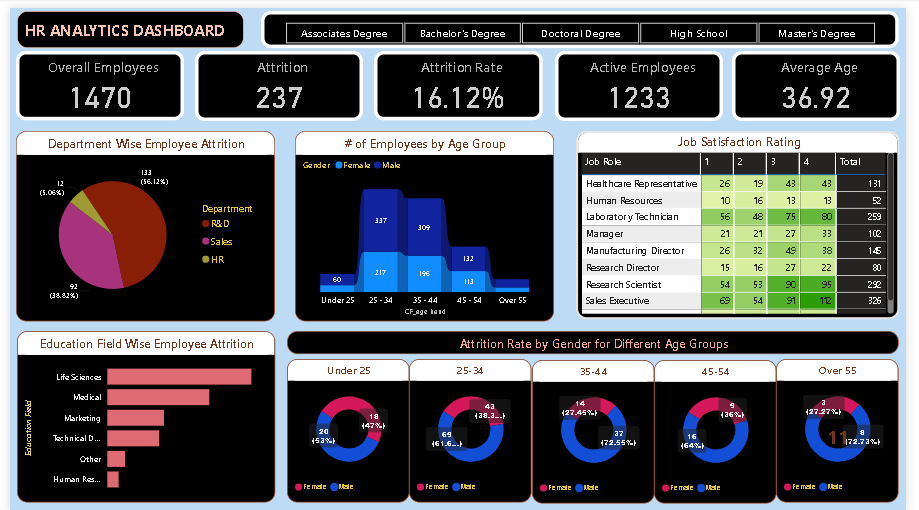
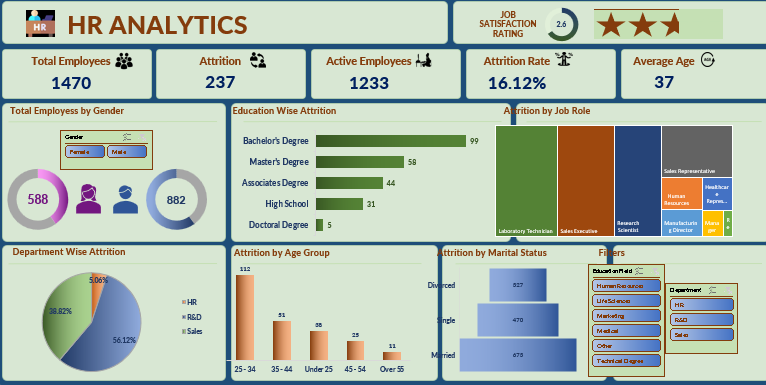

# HR Analytics Dashboard

An HR Analytics project focused on understanding employee attrition,
workforce composition, job satisfaction, and department-level patterns
using **SQL, Excel, and Power BI**.

## Project Overview

The project analyzes an HR dataset containing **1,470 employee records**
and **15 attributes**.

The analysis focuses on questions such as:

-   How many employees are in the organization?
-   What is the overall attrition rate?
-   Which departments have the highest attrition?
-   Which job roles have more employee exits?
-   How does attrition vary by gender and age group?
-   What education fields are associated with higher attrition?
-   How is job satisfaction distributed across job roles?

## Tools Used

-   **SQL / PostgreSQL** --- data analysis and business questions
-   **Microsoft Excel** --- data analysis and dashboarding
-   **Power BI** --- interactive HR dashboard
-   **CSV** --- source dataset

## Dataset

The main dataset is stored in:

`hrdata.csv`

### Dataset Size

  Property                            Value
  ---------------------- ------------------
  Rows                                1,470
  Columns                                15
  Employee ID                      `emp_no`
  Main analysis field           `attrition`
  Employee count field     `employee_count`

### Main Columns

  Column               Description
  -------------------- ----------------------------
  `emp_no`             Unique employee ID
  `gender`             Employee gender
  `marital_status`     Marital status
  `age_band`           Age group
  `age`                Employee age
  `department`         Department
  `education`          Education level
  `education_field`    Education field
  `job_role`           Job role
  `business_travel`    Business travel frequency
  `employee_count`     Employee count
  `attrition`          Whether the employee left
  `attrition_label`    Current or former employee
  `job_satisfaction`   Job satisfaction rating
  `active_employee`    Active employee indicator

## Project Files

``` text
HR-Analytics/
│
├── hrdata.csv
├── HR Analytics Dashboard Power BI.pbix
├── HR Analytics Dashboard Excel.xlsx
├── SQL Analysis.md
└── README.md
```

### Power BI Dashboard

The Power BI report provides an interactive view of:

-   Employee count
-   Attrition count
-   Attrition rate
-   Active employees
-   Average age
-   Department analysis
-   Gender analysis
-   Job role analysis
-   Age-group analysis
-   Job satisfaction

### Excel Dashboard

The Excel version provides supporting analysis using Excel-based
calculations, pivot analysis, and dashboard visuals.

### SQL Analysis

The SQL analysis contains queries for employee and attrition analysis
using PostgreSQL.

See [`SQL Analysis.md`](SQL%20Analysis.md) for the complete query set.

## Business Questions

### Workforce

-   What is the total employee count?
-   What is the average employee age?
-   How are employees distributed across departments and job roles?

### Attrition

-   What is the total attrition count?
-   What is the overall attrition rate?
-   Which departments have the highest attrition?
-   Which job roles have the highest number of exits?
-   How does attrition differ by gender and age group?

### Employee Satisfaction

-   How does job satisfaction vary by job role?
-   Which employee groups show higher attrition?
-   Is there a noticeable relationship between workforce characteristics
    and attrition?

## SQL Skills

The project demonstrates:

-   Table creation
-   CSV data import
-   Filtering
-   Aggregation
-   Grouping
-   Sorting
-   Subqueries
-   Type casting
-   Conditional analysis
-   PostgreSQL `FILTER`
-   PostgreSQL cross-tabulation

## Dashboard Preview

Add screenshots of the final Power BI dashboard here after the dashboard
is polished.





## Notes

The CSV file is the main dataset used for the project. The Power BI and
Excel files are included as portfolio deliverables, while the SQL
analysis documents the database-side analysis performed on the same
dataset.
